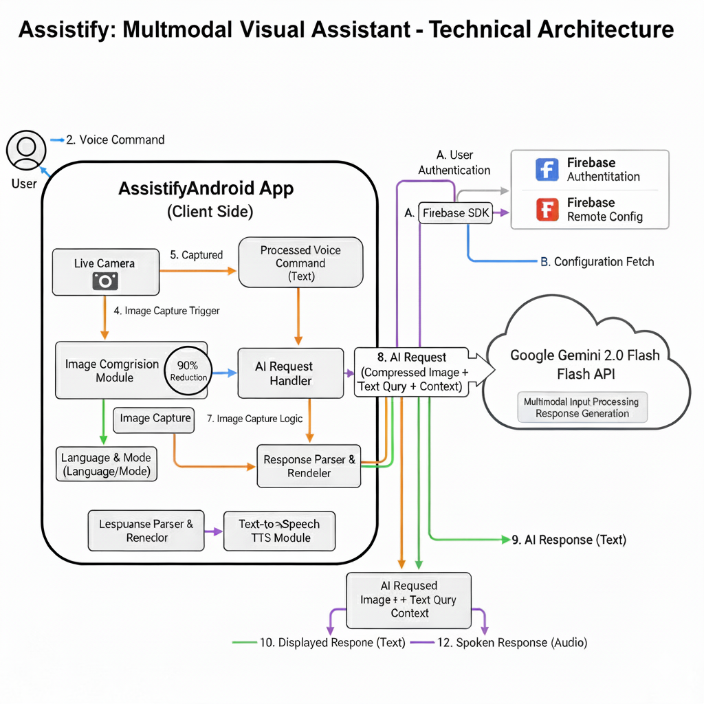

# Assistify /Lenzer - Multimodal Visual Assistant (MVA)

---

## 🌟 Overview

The **Multimodal Visual Assistant (MVA)** is a cutting-edge mobile application designed to bridge the gap between the visual world and instant, multilingual information. By combining **real-time image capture** from a live video feed, **multilingual voice recognition** (supporting 25+ languages), and the powerful **Gemini 2.0 Flash API**, MVA delivers immediate, context-aware visual assistance and information to the user in their preferred language.

This application is built on a **scalable architecture** to ensure rapid response times, high reliability, and future expansion.

---

## ✨ Key Features

* **Multilingual Voice Recognition:** Supports voice commands and response reading in **25+ languages**, including Odia, Marathi, Tamil, Punjabi, Portuguese, English (US/UK), French, German, Kannada, Telugu, Italian, Gujarati, Korean, Assamese, Japanese, Hindi, Malayalam, Chinese, Arabic, Nepali, Bengali, Urdu, and Spanish.
* **Real-Time Visual Capture:** Captures high-quality still images from a live video feed upon a voice command query.
* **Intelligent Image Compression:** Implements a proprietary compression algorithm to reduce image size by up to **90%** before transmission, minimizing latency and data usage without significant loss of visual information.
* **Instant AI Response:** Utilizes the **Google Gemini 2.0 Flash API** for rapid, sophisticated visual analysis and text generation.
* **Text-to-Speech Output:** Reads the received AI response back to the user in their selected language for a hands-free, accessible experience.
* **Specialized Operating Modes:**
    * **Child Mode:** Tailored to simplify explanations and content for children.
    * **Shopping Mode:** Focuses on product identification, pricing, reviews, and comparisons.
    * **Tourism Mode:** Provides historical facts, location details, and translation of signs/menus.
    * **Default Translate Mode:** Offers instant, high-accuracy visual translation.
* **Scalable Architecture:** Designed for high throughput and low latency, enabling reliable performance even with a large user base.

---

## 🖼️ Technical Architecture

This diagram illustrates the comprehensive data flow, from multilingual voice command to the instant AI response powered by Gemini 2.0 Flash and Firebase.

---

## 🛠 Technology Stack

| Component | Technology / Tool | Description |
| :--- | :--- | :--- |
| **AI Model** | Gemini 2.0 Flash API | Core multimodal analysis and generation engine. |
| **Backend/Cloud** | *[S]* | Firebase for user survey. |
| **Mobile Platform** | Android (Java) | User interface and live camera integration. |

---

## 📖 Usage Guide

The MVA app is designed for intuitive, voice-driven interaction.

1.  **Select Language:** On the home screen, select your preferred command and response language from the list of 25+ options.
2.  **Choose Mode:** Tap on the desired operating mode (**Child**, **Shopping**, **Tourism**, or **Default Translate**).
3.  **Activate Voice Command:** Press the **microphone button** and speak your query while pointing the camera at the object or scene.
    * *Example Query (Tourism Mode):* "What is the history of this building?"
4.  **Instant Response:** The app captures the image, compresses it, sends it to Gemini, receives the answer, and **immediately reads the response back to you** in your selected language.

---

## 🌐 Language Support (25+ Languages)

The MVA provides comprehensive voice command and text-to-speech support for:

| Region/Language Group | Languages |
| :--- | :--- |
| **South Asian** | Hindi, Marathi, Bengali, Tamil, Telugu, Kannada, Gujarati, Odia, Assamese, Punjabi, Malayalam, Nepali, Urdu |
| **European** | English (US/UK), French, German, Italian, Spanish, Portuguese |
| **East Asian** | Japanese, Korean, Chinese |
| **Middle Eastern** | Arabic |

---

## 🏗 Architecture and Scalability

The application follows a **microservice-oriented design** to ensure maximum performance and maintainability:

1.  **Client Layer:** Handles the camera feed, local audio recording, and UI.
2.  **Compression Service:** Dedicated module for the 90% image size reduction.
3.  **API Gateway:** Routes compressed image and voice query metadata to the Gemini Service.
4.  **Gemini Service:** Interfaces directly with the **Gemini 2.0 Flash API** for low-latency inference.
5.  **Multilingual TTS Service:** Converts the received text response into audio output in the user's selected language.

This separation of concerns allows each component to scale independently, enabling efficient handling of a high volume of requests.

---

## 📜 License

This project is licensed under the **MIT License** - see the $\texttt{LICENSE}$ file for details.

---

## 📞 Contact

* **Developer:** [Ranjith Kumar AK]
* **Email:** [akranjithkumar03@gmail.com]
